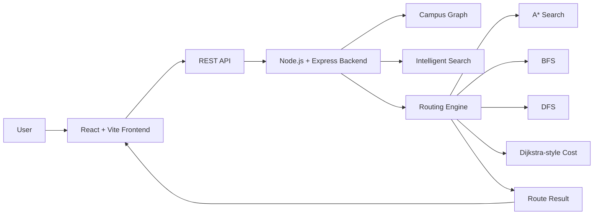
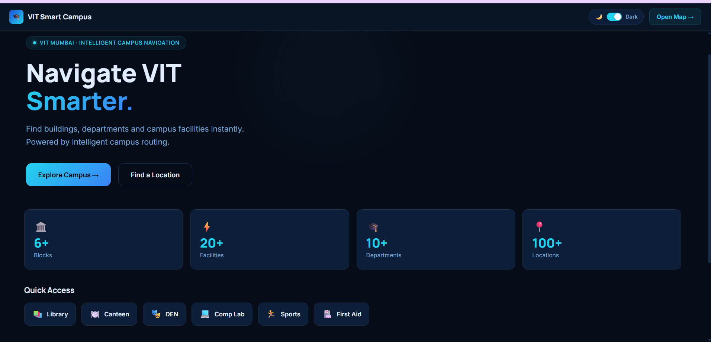
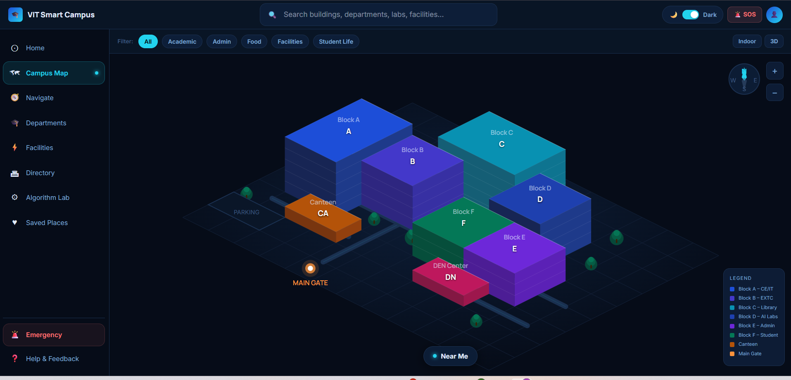
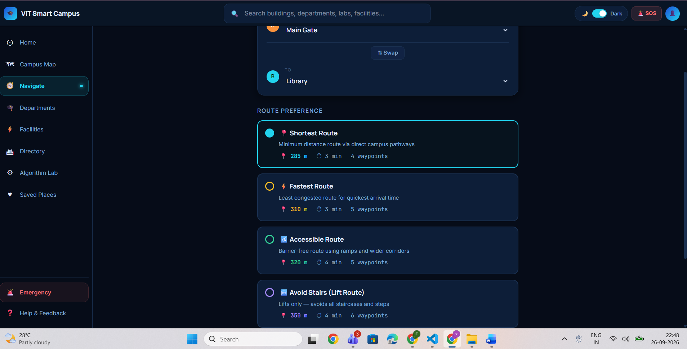
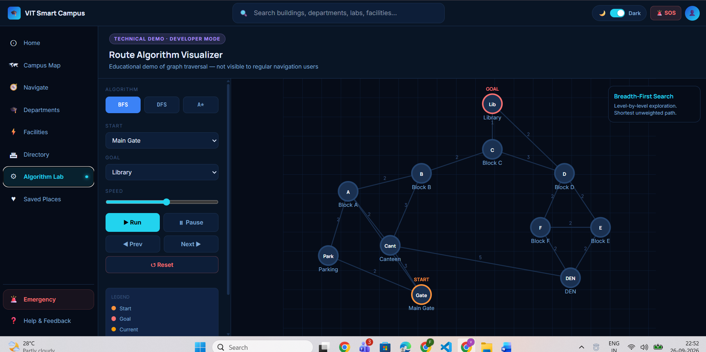
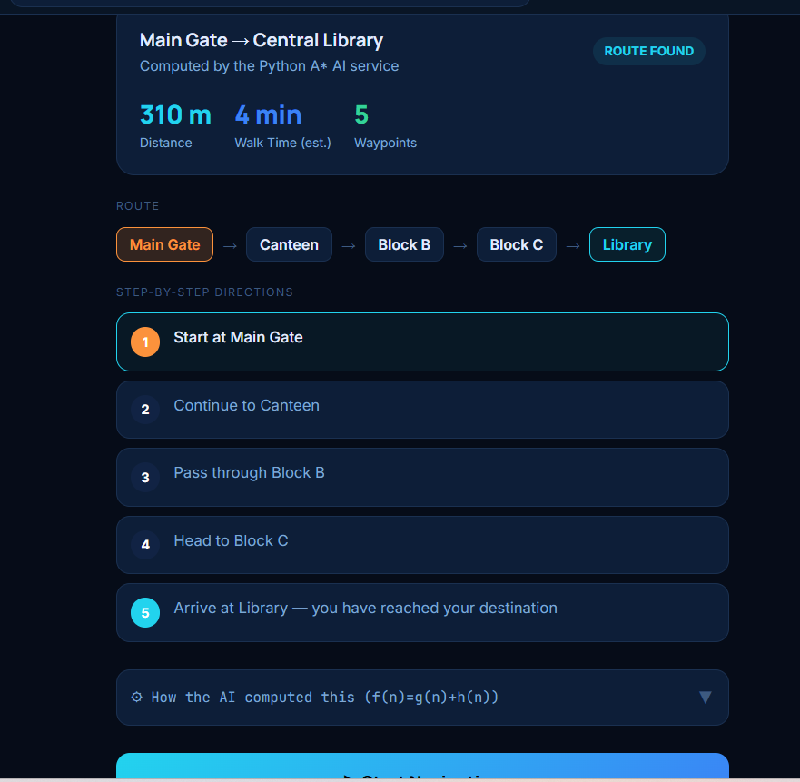
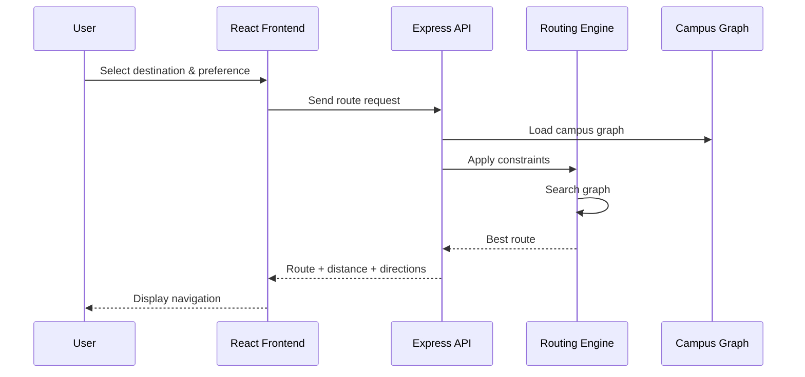

<div align="center">


# 🧭 VIT Smart Campus

### Intelligent Campus Navigation for Vidyalankar Institute of Technology

**Search your campus. Choose your route. Navigate intelligently.**

<br/>

[](https://react.dev/)
[](https://vite.dev/)
[](https://www.typescriptlang.org/)
[](https://nodejs.org/)
[](https://expressjs.com/)
[](https://tailwindcss.com/)
[](#testing)

<br/>

**A graph-based campus navigation system powered by A*, BFS, DFS and Dijkstra-style search.**

</div>

---

## ✦ Overview

**VIT Smart Campus** is an intelligent web-based navigation system designed for **Vidyalankar Institute of Technology (VIT), Mumbai**.

Instead of treating the campus as a static map, the system models it as a **weighted graph**.

```text
                         VIT CAMPUS
                              │
               ┌──────────────┴──────────────┐
               │                             │
             NODES                          EDGES
               │                             │
        Buildings                       Walkways
        Departments                     Corridors
        Laboratories                    Staircases
        Facilities                      Ramps
        Entrances                       Lifts
```

Each connection can contain real-world attributes such as:

- Distance
- Path type
- Accessibility
- Stair availability
- Lift / ramp availability
- Open / closed status
- Restricted status

The system combines multiple classical AI and graph-search techniques to provide **preference-aware campus navigation**.

Users do not need to select an algorithm manually. They simply specify:

> **Where do I want to go?**

and

> **How do I want to get there?**

The backend determines how the graph should be searched.

---

## ✦ The Problem

Large educational campuses contain numerous buildings, departments, laboratories, offices and facilities.

A traditional campus map can show where these places are, but it cannot easily:

- Calculate a suitable route
- Provide alternative routes
- Respect accessibility requirements
- Avoid stairs
- Prefer lifts or ramps
- Avoid restricted paths
- Find the nearest facility
- Understand slightly imprecise search queries

**VIT Smart Campus** addresses these requirements by combining graph representation, search techniques, route constraints and intelligent location search into one system.

---

## ✦ Core Features

| Feature | Description |
|---|---|
| 🧭 **Smart Navigation** | Compute routes between campus locations using graph-based search |
| ♿ **Accessibility** | Support accessible and stair-avoidance preferences |
| 🔎 **Intelligent Search** | Handle synonyms, typos and basic query intent |
| 🛣️ **Alternative Routes** | Generate alternative paths using bounded DFS enumeration |
| 📍 **Nearest Locations** | Find facilities using graph-based cost calculations |
| 🚨 **Emergency Navigation** | Locate exits, security, first aid and assembly points |
| 🧠 **Algorithm Lab** | Visualize graph-search techniques |
| 🗺️ **Campus Graph** | Represent campus locations and connections as a structured weighted graph |

---

## ✦ How It Works

A typical navigation request flows through the system as follows:

```text
┌───────────────────────────────┐
│          USER QUERY           │
│                               │
│   "Library without stairs"    │
└───────────────┬───────────────┘
                │
                ▼
┌───────────────────────────────┐
│      INTELLIGENT SEARCH       │
│                               │
│   Intent + Location Matching  │
└───────────────┬───────────────┘
                │
                ▼
┌───────────────────────────────┐
│       ROUTE PREFERENCE        │
│                               │
│ Accessible / Shortest / etc.  │
└───────────────┬───────────────┘
                │
                ▼
┌───────────────────────────────┐
│       GRAPH CONSTRAINTS       │
│                               │
│   Filter edges + adjust cost  │
└───────────────┬───────────────┘
                │
                ▼
┌───────────────────────────────┐
│           A* SEARCH            │
└───────────────┬───────────────┘
                │
                ▼
┌───────────────────────────────┐
│  ROUTE + DISTANCE + DIRECTIONS│
└───────────────────────────────┘
```

---

## ✦ Route Preferences

The system allows users to select a navigation preference without exposing the underlying algorithms.

| Preference | Behaviour |
|---|---|
| 🟢 **Shortest** | Minimizes total route distance |
| ⚡ **Fastest** | Prioritizes estimated travel cost |
| ♿ **Accessible** | Favors accessible paths |
| 🚫 **Avoid Stairs** | Removes stair-only edges |
| 🛗 **Prefer Lift / Ramp** | Favors accessible vertical movement |
| 🔒 **Avoid Restricted Areas** | Excludes restricted paths |

The backend converts these preferences into graph filters and cost adjustments before route calculation.

---

## ✦ AI & Search Engine

The project uses multiple classical AI and graph-search techniques, each for a specific purpose.

```text
                         CAMPUS GRAPH
                              │
              ┌───────────────┼───────────────┐
              │               │               │
              ▼               ▼               ▼
             A*              BFS             DFS
              │               │               │
        Main Routing      Reachability     Alternatives
              │               │               │
              └───────────────┼───────────────┘
                              │
                              ▼
                    Dijkstra-style Cost
                              │
                              ▼
                     Nearest Locations
```

### A* Search — Primary Routing Engine

A* is the primary route-planning algorithm.

It evaluates:

```text
f(n) = g(n) + h(n)
```

Where:

- `g(n)` = actual accumulated cost from the start node
- `h(n)` = estimated cost remaining to the destination
- `f(n)` = estimated total cost through node `n`

The heuristic is based on the geometric distance between graph nodes.

Route preferences are applied before A* runs, allowing the same search algorithm to support different navigation requirements.

### Breadth-First Search — BFS

BFS explores a graph level by level using a queue.

It is used for:

- Reachability checking
- Fewest-hop analysis
- Technical algorithm visualization

**Complexity**

- Time: `O(V + E)`
- Space: `O(V)`

### Depth-First Search — DFS

DFS explores one branch deeply before backtracking.

The project uses **bounded DFS path enumeration** to generate alternative routes that differ from the primary A* route.

**Complexity**

- Time: `O(V + E)`

### Dijkstra-style Cost Calculation

A Dijkstra-style single-source shortest-cost calculation is used for:

- Distance calculations
- Nearest-location queries
- Facility ranking

Conceptually:

```text
A* with h(n) = 0
```

---

## ✦ Campus Graph

The VIT campus is represented as a structured weighted graph.

### Nodes

Nodes can represent:

- Buildings
- Departments
- Laboratories
- Facilities
- Entrances
- Campus locations

### Edges

Edges represent:

- Walkways
- Corridors
- Staircases
- Ramps
- Lifts

Each connection can contain attributes such as:

- Distance
- Path type
- Accessibility
- Stairs
- Lift / ramp availability
- Open / closed status
- Restricted status

This allows the routing engine to modify the usable graph according to the selected preference.

---

## ✦ Intelligent Search

Users do not always know the exact formal name of a campus location.

The intelligent search layer supports:

- Synonym handling
- Typo tolerance
- Query normalization
- Basic intent detection
- Location matching

### Search Pipeline

```text
User Query
    │
    ▼
Text Normalization
    │
    ▼
Intent Detection
    │
    ├── Find
    ├── Route
    └── Nearest
    │
    ▼
Synonym Expansion
    │
    ▼
Location Matching
    │
    ▼
Relevance / Proximity Ranking
    │
    ▼
Search Results
```

### Example Queries

```text
"find library"
"where is IT department?"
"nearest washroom"
"where is the canteen?"
"find auditorium"
"nearest first aid"
```

The system is designed to support natural and slightly imperfect campus queries.

---

## ✦ Emergency Navigation

The application includes a dedicated emergency navigation layer.

```text
                       EMERGENCY
                           │
             ┌─────────────┼─────────────┐
             │             │             │
             ▼             ▼             ▼
           EXIT         SECURITY      FIRST AID
                           │
                           ▼
                    ASSEMBLY POINT
```

Emergency navigation helps users quickly locate important safety-related campus locations.

---

## ✦ System Architecture



---

## ✦ Frontend

The frontend is built with:

- React
- Vite
- TypeScript
- Tailwind CSS

### Main Interface Areas

```text
Home / Dashboard
      │
      ├── Campus Map
      ├── Navigation
      ├── Departments
      ├── Facilities
      ├── Directory
      ├── Algorithm Lab
      ├── Saved Places
      └── Emergency
```

The interface combines a practical navigation experience with technical visualizations of the underlying AI search algorithms.

---

## ✦ Screenshots

Add your actual screenshots to `docs/screenshots/` using these filenames:

```text
docs/screenshots/
├── dashboard.png
├── campus-map.png
├── navigation.png
├── algorithm-lab.png
└── route.png
```

<div align="center">

### Dashboard



### Interactive Campus Map



### Navigation & Route Preferences



### Algorithm Visualizer



### Route Directions



</div>

---

## ✦ Example Route

```text
MAIN GATE
    │
    ▼
CANTEEN
    │
    ▼
BLOCK B
    │
    ▼
BLOCK C
    │
    ▼
CENTRAL LIBRARY
```

### Example Result

```text
┌──────────────────────────────────┐
│           ROUTE FOUND            │
├──────────────────────────────────┤
│                                  │
│  Distance       310 m            │
│  Walking Time   ~4 min           │
│  Waypoints      5                │
│                                  │
├──────────────────────────────────┤
│                                  │
│  Main Gate → Canteen             │
│  Canteen → Block B               │
│  Block B → Block C               │
│  Block C → Library               │
│                                  │
└──────────────────────────────────┘
```

---

## ✦ Frontend → Backend Flow



---

## ✦ API

The frontend API client is prepared for backend route requests.

```typescript
import { api } from "./api/client";

api.findRoute({
  from: "entrance",
  to: "library",
  routePreference: "accessible"
});
```

### Backend Endpoints

| Method | Endpoint | Purpose |
|---|---|---|
| `GET` | `/health` | Health check |
| `GET` | `/ready` | Readiness check |
| `POST` | `/api/v1/route` | Route calculation |

The API supports route calculation, location-related operations, validation and health/readiness checks.

---

## ✦ Backend

The backend is built using:

- Node.js
- Express
- TypeScript

### Backend Responsibilities

```text
Campus Graph
     │
     ├── Location Data
     ├── Graph Nodes
     └── Graph Edges
            │
            ▼
     Search Service
            │
            ▼
     Routing Engine
            │
            ├── A*
            ├── BFS
            ├── DFS
            └── Dijkstra-style
            │
            ▼
         REST API
```

---

## ✦ Security & Validation

The backend includes:

- Helmet security headers
- CORS configuration
- Request rate limiting
- Zod schema validation
- Structured API error handling
- Health/readiness endpoints

Invalid location IDs and malformed requests are handled through validation instead of allowing the service to crash.

---

## ✦ Testing

The backend includes automated unit and API tests using:

- Vitest
- Supertest

### Run the Test Suite

```bash
cd backend
npm test
```

### Current Test Status

```text
╭────────────────────────────────────╮
│       VIT SMART CAMPUS TESTS       │
├────────────────────────────────────┤
│                                    │
│  Routing Engine          ✓ PASS    │
│  A* Search               ✓ PASS    │
│  Graph Validation        ✓ PASS    │
│  REST API                ✓ PASS    │
│  Route Preferences       ✓ PASS    │
│  Error Handling          ✓ PASS    │
│  Health Endpoints        ✓ PASS    │
│                                    │
│  Total: 58 tests         ✓ PASS    │
│                                    │
╰────────────────────────────────────╯
```

---

## ✦ Tech Stack

| Layer | Technologies |
|---|---|
| **Frontend** | React · Vite · TypeScript · Tailwind CSS |
| **Backend** | Node.js · Express · TypeScript |
| **AI / Search** | A* · BFS · DFS · Dijkstra-style |
| **Graph Data** | Structured JSON Campus Graph |
| **Validation** | Zod |
| **Security** | Helmet · CORS · Rate Limiting |
| **Testing** | Vitest · Supertest |

---

## ✦ Project Structure

```text
vit-smart-campus/
│
├── frontend/
│   ├── src/
│   │   ├── api/
│   │   │   └── client.ts
│   │   ├── App.tsx
│   │   └── ...
│   ├── package.json
│   └── ...
│
├── backend/
│   ├── src/
│   │   ├── graph/
│   │   ├── routes/
│   │   ├── services/
│   │   └── ...
│   │
│   ├── data/
│   │   ├── graph.nodes.json
│   │   └── graph.edges.json
│   │
│   ├── tests/
│   ├── package.json
│   └── README.md
│
├── docs/
│   └── screenshots/
│
├── assets/
│   └── vit-smart-campus-logo.svg
│
└── README.md
```

---

## ✦ Run Locally

### 1. Start the Backend

Open a terminal:

```bash
cd backend
npm install
npm run dev
```

Backend:

```text
http://localhost:4000
```

Health check:

```text
http://localhost:4000/health
```

### 2. Start the Frontend

Open a second terminal:

```bash
cd frontend
npm install
npm run dev
```

Vite will display the frontend URL, usually:

```text
http://localhost:5173
```

### Quick Start

```bash
# Terminal 1
cd backend
npm install
npm run dev
```

```bash
# Terminal 2
cd frontend
npm install
npm run dev
```

---

## ✦ What Makes This Project Different?

### 01 — Algorithms Work Together

This is not just an A* implementation.

The system combines:

```text
A*
 +
BFS
 +
DFS
 +
Dijkstra-style calculation
 +
Graph representation
 +
Constraint-based routing
 +
Intelligent search
```

### 02 — User Intent Drives the Routing

The user does not choose:

```text
"A*"
"BFS"
"Dijkstra"
```

Instead, the user chooses:

```text
Shortest
Fastest
Accessible
Avoid Stairs
Prefer Lift / Ramp
Avoid Restricted Areas
```

The backend translates those preferences into routing constraints.

### 03 — Real-World Campus Constraints

The graph is not simply:

```text
Node A → Node B
```

Connections can include:

```text
Distance
Accessibility
Stairs
Lift
Ramp
Open / Closed
Restricted
```

This allows the route engine to behave more like a real navigation system.

### 04 — Search Beyond Exact Names

The intelligent search layer supports:

- Synonyms
- Typo tolerance
- Intent detection
- Location ranking

This makes campus discovery more natural.

### 05 — Practical + Educational

The project serves two purposes:

```text
                 VIT SMART CAMPUS
                         │
             ┌───────────┴───────────┐
             │                       │
             ▼                       ▼
      PRACTICAL SYSTEM          AI EDUCATION
             │                       │
      Campus Navigation        Algorithm Lab
      Emergency Search          BFS / DFS / A*
      Accessibility             Graph Search
      Smart Discovery           Visualization
```

---

## ✦ Current Status

| Component | Status |
|---|---|
| Campus Graph | ✅ Complete |
| A* Routing | ✅ Complete |
| BFS Analysis | ✅ Complete |
| DFS Alternatives | ✅ Complete |
| Dijkstra-style Cost | ✅ Complete |
| Route Preferences | ✅ Complete |
| Intelligent Search | ✅ Complete |
| Emergency Navigation | ✅ Complete |
| Backend API | ✅ Complete |
| Automated Testing | ✅ 58 Tests Passing |
| Frontend UI | ✅ Complete |
| Frontend → Backend Integration | 🔄 API client prepared |

The current frontend preserves the original Figma Make interface and uses its built-in demo data. The API client is prepared for backend integration.

---

## ✦ Future Scope

The project can evolve into a more advanced smart-campus platform through:

- Live congestion data
- Dynamic path closures
- Richer accessibility modelling
- Indoor floor-level navigation
- Live positioning
- Voice-based navigation
- Multilingual search
- Mobile application

---

## ✦ Project Highlights

```text
                 ┌─────────────────┐
                 │  CAMPUS GRAPH   │
                 └────────┬────────┘
                          │
                          ▼
                 ┌───────────────────┐
                 │ INTELLIGENT SEARCH│
                 └─────────┬─────────┘
                           │
                           ▼
                 ┌───────────────────┐
                 │ USER PREFERENCES  │
                 └─────────┬─────────┘
                           │
                           ▼
              ┌────────────────────────┐
              │    AI SEARCH ENGINE    │
              │                        │
              │ A* │ BFS │ DFS │ Dijk  │
              └───────────┬────────────┘
                          │
                          ▼
                 ┌───────────────────┐
                 │ SMART NAVIGATION  │
                 └───────────────────┘
```

---

## ✦ Team

<div align="center">

**Built at Vidyalankar Institute of Technology, Mumbai**

**Shravani Sujit Kadam**  
**Tanvi Naresh Jaware**

</div>

---

## ✦ References

1. Hart, P. E., Nilsson, N. J., & Raphael, B. (1968).  
   *A Formal Basis for the Heuristic Determination of Minimum Cost Paths.*

2. Dijkstra, E. W. (1959).  
   *A Note on Two Problems in Connexion with Graphs.*

3. Russell, S. & Norvig.  
   *Artificial Intelligence: A Modern Approach.*

4. Cormen, Leiserson, Rivest & Stein.  
   *Introduction to Algorithms.*

---

<div align="center">

## 🧭 VIT Smart Campus

**Search. Route. Navigate.**

An applied AI project combining classical search algorithms with a modern full-stack campus navigation experience.

⭐ **Star this repository if you find it interesting.**

</div>
